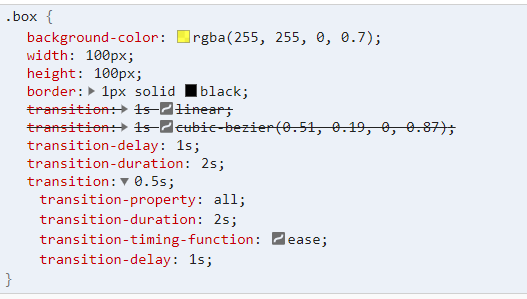
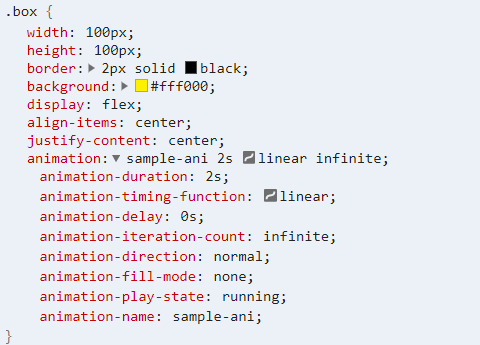
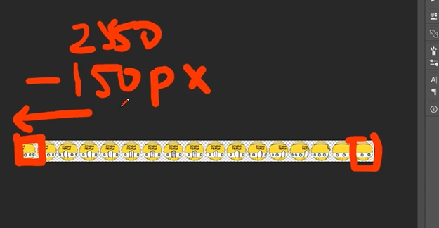
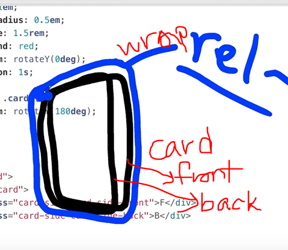
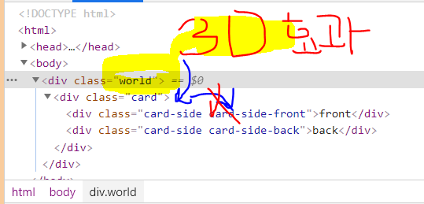

# interactive Web Basic
studiomeal 일분코딩 인터렉티브웹 강의 따라하기

## CSS 변환과 애니메이션

- [모질라 MDN: transform](https://developer.mozilla.org/ko/docs/Web/CSS/transform)
- [모질라 MDN: transition](https://developer.mozilla.org/ko/docs/Web/CSS/transition)
  - [css transition examples](https://developer.mozilla.org/ko/docs/Web/CSS/CSS_Transitions/Using_CSS_transitions)
- transform 스타일 스크린샷

<figure style="display: block; margin: 0 auto; text-align: center">

<figcaption  style="color: gray; font-size: 10px">css: transform</figcaption>
</figure>

<figure style="display: block; margin: 0 auto; text-align: center">

<figcaption  style="color: gray; font-size: 10px">css: transition</figcaption>
</figure>


- transition 과 animation 차이점
  - 애니메이션 특징: keyframe 추가 가능

- ANIMATION 관련 속성들
1. [animation-direction](https://developer.mozilla.org/ko/docs/Web/CSS/animation-direction)

```css
/* Single animation */
animation-direction: normal;
animation-direction: reverse;
animation-direction: alternate;
animation-direction: alternate-reverse;

/* Multiple animations */
animation-direction: normal, reverse;
animation-direction: alternate, reverse, normal;

/* Global values */
animation-direction: inherit;
animation-direction: initial;
animation-direction: unset;
```

2. [animation-fill-mode](https://developer.mozilla.org/ko/docs/Web/CSS/animation-fill-mode)

- 애니메이션 오브젝트의 마지막 위치를 정해줄 수 있음.

```css
/* 속성 종류 */
/* Single animation */
animation-fill-mode: none;
animation-fill-mode: forwards;
animation-fill-mode: backwards;
animation-fill-mode: both;

/* Multiple animations */
animation-fill-mode: none, backwards;
animation-fill-mode: both, forwards, none;
```

3. Gif <<< Svg 애니메이션 사용 이유

- svg 알파 채널 사용이 가능해서 깔끔
- gif 는 투명도 조절을 못하는 단점
- 코드로 움직임을 제어할 수 있다.

```css

animation: spaceship-ani 1s infinite;
animation: spaceship-ani 1s infinite steps(17);
animation: spaceship-ani 1s infinite reverse steps(17);

```

4. 추가 설명

<figure style="display: block; margin: 0 auto; text-align: center">

<figcaption style="color: gray; font-size: 10px">keyframe: background-position -2550px 인 이유</figcaption>
</figure>

## CSS 3D 

1. em 과 rem 의 차이점 알아두기

2. perspective 와 transform 이라는 css 속성을 사용해서 원근감 효과를 구현할 수 있다.
  - [css: perspective 속성](https://developer.mozilla.org/en-US/docs/Web/CSS/perspective)

3. card 앞 뒤를 만들어주고 위치를 고정하기 위해, wrapper 포지션을 relative로 잡는다. 부모 element 의 포지션이 static (포지션의 디폴트 값) 이 아니어야지, 자식 엘리먼트의 포지션을 absolute 로 설정할 수 있다.
<figure style="display: block; margin: 0 auto; text-align: center">

<figcaption  style="color: gray; font-size: 10px">card-side front & back : position 설명 그림</figcaption>
</figure>

4. 3d 효과는 자식의 자식엘리먼트에까지 영향을 미치지 못함. 한단계 아래까지만 적용되므로 주의해야함.

- card 엘리먼트에 `transform-style: preserve-3d;` 추가해줘야 함

<figure style="display: block; margin: 0 auto; text-align: center">

<figcaption  style="color: gray; font-size: 10px">world - card - card side 엘리먼트</figcaption>
</figure>


5. 정리
- world 안에 카드 한장이 있다.
- card-side-front 는 정면을 바라보고 있고, card-side-back 은 기본 설정이 뒤집혀있다.
  - 그래야지 `mouse hover` 발생시, 카드 전체가 `transform: rotateY(180deg)` 할 때 back 이 뒤집어지지 않고 정면을 바라보도록 해준다.
- card-side 에서 `backface-visibility: hidden` 속성을 설정해서 front, back 각자의 뒷면이 안보이도록 처리해줘야 한다.

6. css 3d 3: 다양한 브라우저 호환성
- internet explorer 에서는 `preserve-3d` 적용이 불가능하다
	- card 클래스를 없앤다
	- card-side 에 모양 css 를 다 적용시킨다
	- front, back 이 따로 놀게 된다.
	- card-side-front 는 0에서 180도 회전
	- card-side-back 은 180도에서 360도 회전하도록 hover css 를 각각 지정해준다. 